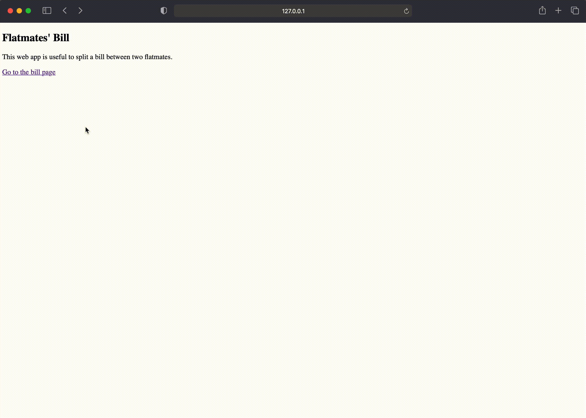

# Flatmates Bill App
The Flatmates Bill app using Python. I used IntelliJ for this project. 

# Description
An app that in the form gets input the amount of bill for period and the days that each of flatmates stayed in the house for that period. It returns how much each flatmate has to pay.

# Python Libraries:
- Flask (https://flask.palletsprojects.com/en/1.1.x/)
- Wtforms (https://wtforms.readthedocs.io/en/2.3.x/)

# Demo

